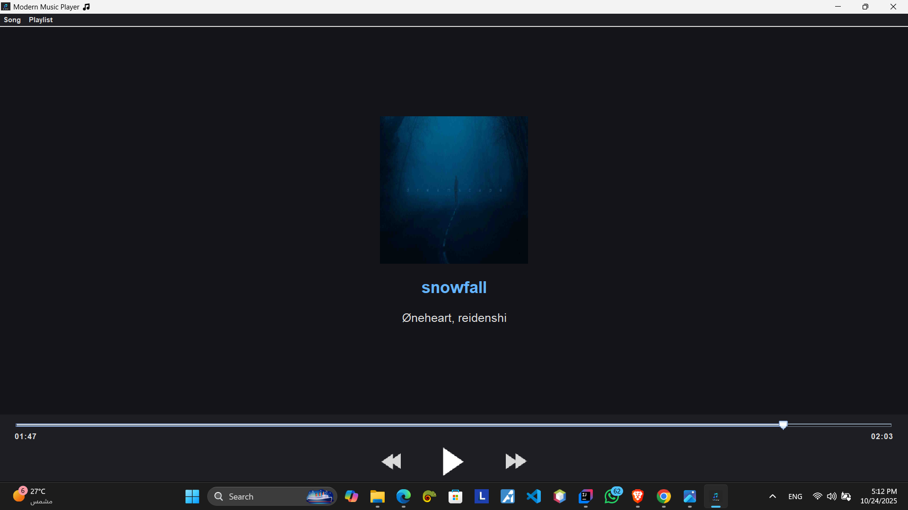

# 🎵 Modern Music Player - Java Swing Application



## 🧭 Overview
The **Modern Music Player** is a desktop application developed in **Java** using the **Swing** framework.  
It provides a clean, responsive, and visually appealing user interface for playing MP3 files, featuring real-time playback control and metadata (ID3 tag) reading.

This project was built with a focus on modernizing the classic Java Swing look and feel by implementing:
- Custom color palettes  
- Flexible layout managers (`BorderLayout`, `GridBagLayout`)  
- Streamlined control handling  

---

## ✨ Features
- 🎧 **MP3 Playback:** Seamless playback of local MP3 files using the **JLayer** library.  
- 🖤 **Modern UI/UX:** Dark-themed interface built using optimized Swing components and custom styling.  
- ⏯️ **Real-Time Control:** Play, Pause, Previous, and Next track controls.  
- 🎚️ **Playback Slider:** Synchronized slider reflecting the current song position, with current and total time display.  
- 🏷️ **Metadata Reading:** Automatically reads and displays Song Title and Artist from the MP3 file’s ID3 tags (via **JAudioTagger**).  
- ⌨️ **Global Keybinds:** Spacebar shortcut for Play/Pause toggle.  

---

## 🛠️ Technology Stack

| Component        | Technology       | Purpose |
|------------------|------------------|----------|
| **GUI Framework** | Java Swing       | The primary library for building the desktop UI. |
| **Core Language** | Java (JDK 8+)    | Application logic and threading management. |
| **MP3 Playback**  | JLayer           | Decodes and plays MP3 audio files. |
| **MP3 Metadata**  | JAudioTagger     | Extracts ID3 tag information (Title, Artist). |
| **MP3 File Data** | MP3agic          | Handles low-level MP3 file structure (frames, lengths). |

---

## 🚀 Getting Started

### Prerequisites
You must have the following installed:
- ☕ **Java Development Kit (JDK)** version **8 or newer**  
- 💻 **IDE** such as IntelliJ IDEA, Eclipse, or VS Code (with Java extensions)

---

### Installation & Setup

#### 1. Clone the Repository:
```bash
git clone https://github.com/ibrahimMohamed124/AudioPlayer-in-Java.git
cd modern-music-player
